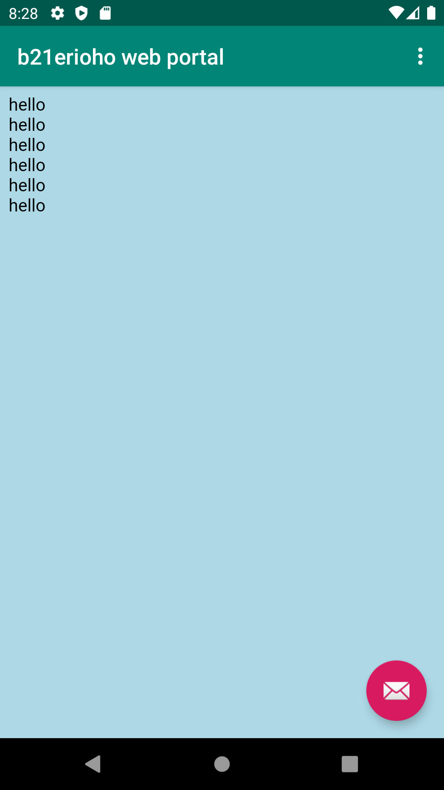
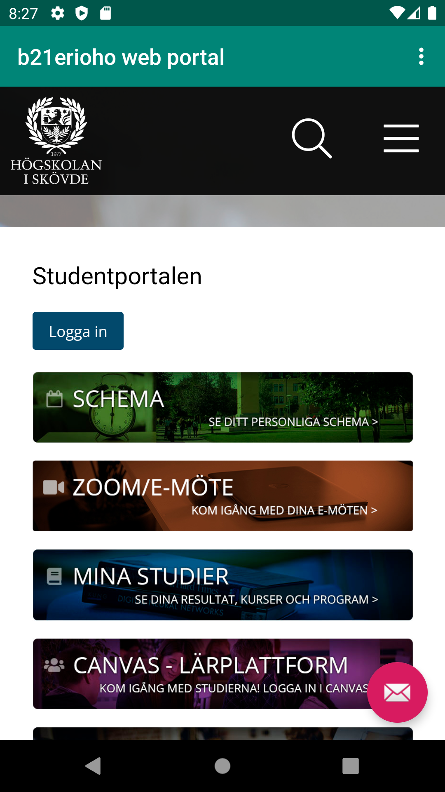

# Report

To begin with, the title of the app was changed in values/string and the line for allowing internet access was added to the manifest. After this the view in content_main
and it was given an id. The layout with and height was also changed to match-parent. Further a very basic html file was created to be used as the internal site.
Lastly in mainActivity the view was found, stored and given an url

After this the given functions for noticing when either alternative page was selected was implemented to call the given functions and said functions were given a 
loadurl call to the wanted page. Lastly a webviewclient was implemented, the internal page finalized and a top-margin was added to prevent the page from sliding
under the toolbar.

Page-changing is done by this code, partially pre-declared by the preset project
```
if (id == R.id.action_internal_web) {
            showInternalWebPage();
            return true;
        }
```
which runs this code
```
public void showInternalWebPage(){
        myWebView.loadUrl("file:///android_asset/internal.html");
    }
```
That sets the url to that of the local hmtl-file



